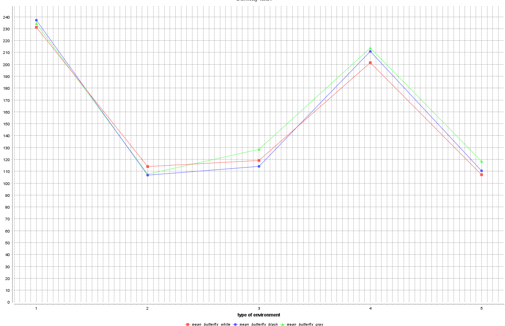

# Butterfly color evolution
### Student Name: Nguyen Xuan Tung
### Student ID: M22.ICT.006

### Base Model
- The butterflies are moving
- The reproduction is working and smooth

### Extension 1
- The predators are now targeting butterflies within a diameter of 2
- If it meets other butterflies on its way, it still eats that butterfly

### Extension 2
- Update different types of environment transition

### Extension 3
- Run the simulation with different types of environment transition to see which one affects the butterflies
